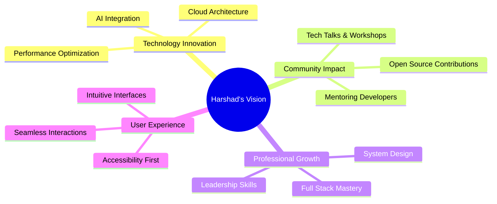

<div align="center">

<!-- Animated Header with Gradient -->


<!-- Typing Animation -->
<a href="https://git.io/typing-svg"></a>

<br/>

<!-- Animated Badge Row -->
<p>
  
  
  
</p>

<!-- Animated Line -->


</div>

## 🎯 About Me

```javascript
const harshad = {
    role: "Vibe Coder & Software Developer",
    location: "Amroli, Surat, India 🇮🇳",
    experience: "2.5+ Years",
    currentRole: "Store Manager @ Gopani Books",
    passions: ["Clean Code", "UI/UX Design", "Problem Solving"],
    languages: ["English", "Gujarati", "Hindi"],
    motto: "Turning complex problems into elegant solutions ✨",
    
    currentlyLearning: ["Advanced React Patterns", "System Design", "Cloud Architecture"],
    funFact: "I started with 'Hello World' and never looked back! 🚀",
    
    lifePhilosophy: "Code is poetry, and every bug is a plot twist! 📖"
};
```

<div align="center">
  
### 💼 Professional Highlights

🎯 **Led frontend projects** increasing user engagement by **30%**  
⚡ **Optimized performance** reducing load times by **50%**  
🌟 **Open-source contributor** with **10k+ stars** on GitHub projects  
🎤 **Vibe Coder** at Regional Web Developers Conference 2026

</div>


## 🛠️ Tech Arsenal

<div align="center">

### 🎨 Frontend Development
<p>
  
  
  
  
  
</p>

### ⚙️ Backend & Database
<p>
  
  
  
  
  
</p>

### 🔧 Tools & Platforms
<p>
  
  
  
  
  
  
</p>

</div>


## 📊 GitHub Statistics

<div align="center">
  
  
</div>

<div align="center">
  
  
</div>

<div align="center">
  
</div>


## 🎯 Vision & Goals

<div align="center">



</div>

### 🎯 My Mission
> *"Leverage technology to build intuitive and impactful digital solutions that solve real-world problems. Create software that is not only technically robust but also provides a seamless and enjoyable user experience."*

<div align="center">

| 🎯 Goal | 📈 Progress |
|---------|-------------|
| Master System Design | ████████░░ 80% |
| Contribute to Open Source | ██████████ 100% |
| Build SaaS Products | ██████░░░░ 60% |
| Mentor Junior Devs | ███████░░░ 70% |

</div>


## 🌟 Featured Projects

<div align="center">

<table>
<tr>
<td width="50%">
<h3 align="center">🎨 Portfolio Website</h3>
<div align="center">  
<a href="https://portfolio-hj.vercel.app/" target="_blank">

</a>
<p><strong>Tech Stack:</strong> React.js, Tailwind CSS, Framer Motion</p>
<p>A stunning portfolio showcasing my journey and projects with smooth animations and modern design.</p>
</div>
</td>
<td width="50%">
<h3 align="center">💼 Enterprise Solutions</h3>
<div align="center">

<p><strong>Tech Stack:</strong> React, Node.js, MongoDB</p>
<p>Building scalable enterprise-level applications with focus on performance and user experience.</p>
</div>
</td>
</tr>
</table>

</div>


## 🤝 Let's Connect & Collaborate

<div align="center">

### 💬 I'm always excited to discuss:
✨ **Web Development Projects** | 🚀 **Startup Ideas** | 🎨 **UI/UX Design** | 💡 **Tech Innovations** | 🤝 **Open Source Collaborations**

<br/>

<a href="https://wa.me/9327128042?text=Hello%20Harshad%2C%0A%0AI%20saw%20your%20GitHub%20profile%20and%20would%20like%20to%20connect.">
  
</a>
<a href="https://www.linkedin.com/in/harshad-jethva-470745312/">
  
</a>
<a href="https://github.com/Harshad-Jethva">
  
</a>
<a href="mailto:harshadjethva2111@gmail.com">
  
</a>
<a href="https://portfolio-hj.vercel.app/">
  
</a>

<br/><br/>

### 📧 Reach Out For:
<table>
<tr>
<td align="center" width="25%">
<br/>
<strong>Frontend Development</strong>
</td>
<td align="center" width="25%">
<br/>
<strong>UI/UX Consultation</strong>
</td>
<td align="center" width="25%">
<br/>
<strong>Code Reviews</strong>
</td>
<td align="center" width="25%">
<br/>
<strong>Mentorship</strong>
</td>
</tr>
</table>

</div>


## 💭 Dev Quote of the Day

<div align="center">


</div>


## 📈 Contribution Activity

<div align="center">


</div>


## 🎵 Currently Vibing To

<div align="center">

[](https://spotify-github-profile.kittinanx.com/api/view?uid=31l5bw4ixhf3rnx2evtyb7lmmmqy&redirect=true)

</div>


## 🐍 Contribution Snake

<div align="center">

<picture>
  <source media="(prefers-color-scheme: dark)" srcset="https://raw.githubusercontent.com/Harshad-Jethva/Harshad-Jethva/output/github-contribution-grid-snake-dark.svg">
  <source media="(prefers-color-scheme: light)" srcset="https://raw.githubusercontent.com/Harshad-Jethva/Harshad-Jethva/output/github-contribution-grid-snake.svg">
  
</picture>

</div>


<div align="center">

### 👀 Profile Views Counter


<br/><br/>

### ⭐ Show Some Love!

*If you like what you see, feel free to ⭐ star some repositories and follow for more amazing projects!*

<br/>

**💙 Thanks for visiting! Let's build something amazing together! 🚀**


</div>

---

<div align="center">
  <sub>✨ Crafted with 💙 by <strong>HARSHAD JETHVA</strong> | HJ INFOTECH © 2025</sub>
</div>
